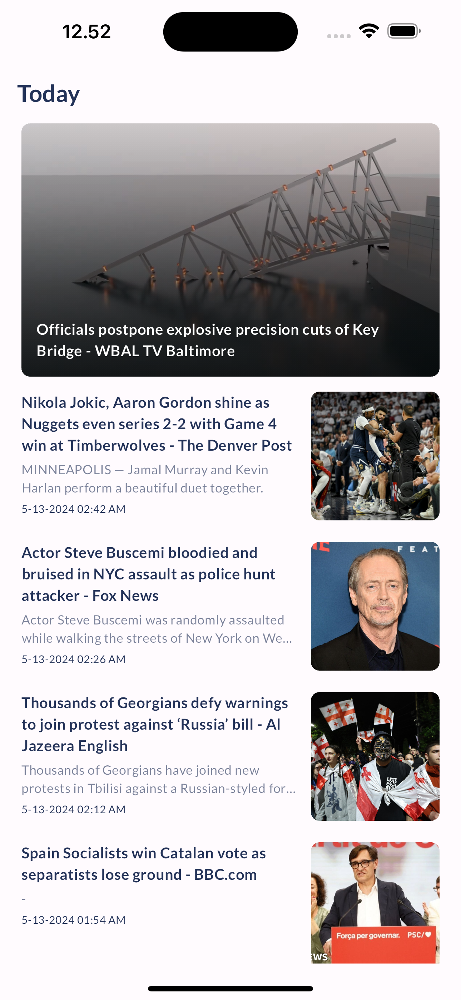
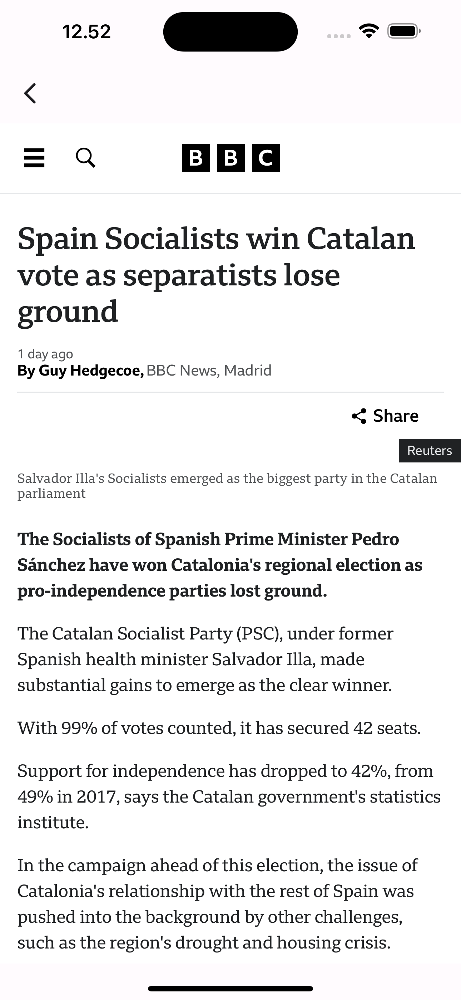

# News App

A simple Flutter news app that allows users to browse and read news articles from various sources.

## Features

- Browse news articles from different sources.
- View details of individual news articles.
- Save favorite articles for later reading.
- Search for specific news articles.

## Installation

To run this app locally, follow these steps:

1. Clone this repository.
2. Navigate to the project directory.
3. Run `flutter pub get` to install dependencies.
4. open utils folder and Run `flutter pub get` to install dependencies on utils module.
5. Connect a device or emulator.
6. Run `flutter run` to launch the app.

## Dependencies

- `json_annotation`: For JSON serialization/deserialization.
- `dartz`: Functional programming in Dart.
- `cached_network_image`: Caching network images for efficient loading.
- `equatable`: Simplify equality comparisons.
- `dio`: HTTP client for making network requests.
- `auto_route`: Route generation library for Flutter.
- `internet_connection_checker_plus`: Check internet connection status.
- `flex_color_scheme`: Flexible color schemes for Flutter.
- `another_flushbar`: Customizable flushbar notifications.
- `google_fonts`: Easily use Google Fonts in Flutter.
- `sqflite`: SQLite database wrapper for Flutter.
- `get_it`: Simple service locator for Flutter.
- `flutter_bloc`: State management library for Flutter.
- `stream_transform`: Functional reactive programming utilities.
- `bloc_concurrency`: Manage concurrency in BLoC.
- `shimmer`: Loading shimmer effect.
- `intl`: Internationalization and localization library for Dart.
- `logger`: Logging utility.
- `webview_flutter`: Flutter WebView plugin.
- `utils`: Local resubale module stored all utilities.
  

## Folder Structure

The project follows a clean architecture Flutter folder structure with the following directories:

- **core**: Contains core functionality shared across the application, such as constants, and base classes.
- **domain**: Contains domain-specific logic and entities.
- **data**: Manages data sources,implement repositories, and data providers local or remote.
- **presentations**: Contains UI-related code, including screens, widgets, and blocs.

## Screenshoot

